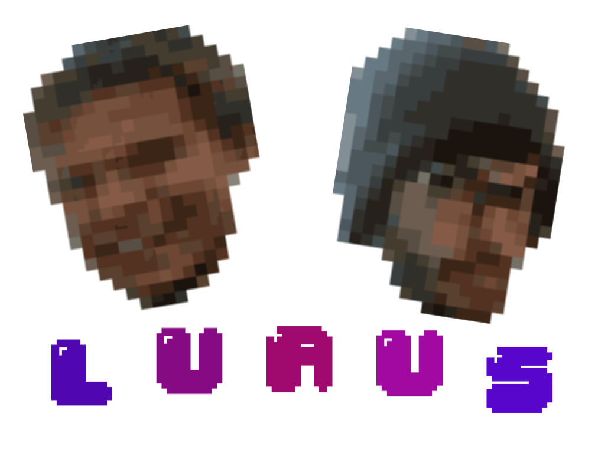

<h1 align="center">
	
	<br>
	<br>
</h1>

<p align="center">
	<b>🚨 Scoreboard @ <a href="http://luaus.rijks.website">luaus.rijks.website</a> 🚨</b>
</p>

[](https://semaphoreci.com/rijkvanzanten/luaus)
[](https://github.com/prettier/prettier)

# Luaus
**luau** | luːaʊ  
_Syllables 2 — lu • au_

**noun** _(party)_  
a Hawaiian party or feast, especially one accompanied by entertainment.

---

Luaus is an online scoreboard for all your favorite (board) games.  
Do you want to play a match of fooßball? Want to test who's best at airhockey? Or do you want to have a race with your Facebook friends, to establish who can do push-ups the fastest?

The possibilities are endless! This scoreboard is designed with exactly that in mind. It doesn't matter where you are, you can either be in the same room with your friends/competitors or globally play against each other.

Keep track of your scores with Luaus!

---


Want to experiment with the Luaus code yourself? Clone this repository first. You can do this by typing the following command in your terminal:  
```shell
$ git clone https://github.com/rijkvanzanten/luaus.git
```

Install the dependencies by typing 
```shell
$ npm install
```

To start the app, run 
```shell
$ npm run start
```

To start the server with nodemon, run 
```shell
$ npm run dev-server
```

To watch for client-side file changes, like JavaScript and CSS, run 
```shell
$ npm run dev-client
```

Add your own .env file with the following contents, or don't*:
```
TWITTER_CONSUMER_KEY=<consumer_key>
TWITTER_CONSUMER_SECRET=<consumer_secret>
TWITTER_ACCESS_TOKEN_KEY=<access_token_key>
TWITTER_ACCESS_TOKEN_SECRET=<access_token_secret>
```
*Nothing will be posted to Twitter when there are no credentials supplied. If you would like to have access to the _official_ Luaus Live Twitter bot, [email Rijk](mailto:rijkvanzanten@me.com) or slide into Rijk's [DMs](http://twitter.com/rijkvanzanten).

---


This scoreboard has a lot of built-in features. The next list is documented according to the flow of play, from the zero-state to the end of a game.

### Real-time traffic
Luaus is completely real-time; meaning that everything that happens, from a player joining a game to that same player winning the game, is immediately visible for everyone who needs this information. This makes sure that there are no delays during actions.

Here is the exact list of real-time events:
- Game creation
- Player join
- Name change (either game name or player name)
- Score goal update
- Game start
- Player score increase
- Player reaching score goal / Player win
- Game deletion
- Tweets

### Game lobby 
People who want to play a game with Luaus are first presented with the lobby. In here they'll find a list of created games, some of which are already at play. If they decide to join an already existing game, they can do so by just clicking on the name. The other option is to create a game themselves. This is done in an instant if the `Create Luau` button is clicked.  
A new game has been created, and is given a random name (from the [Namey! API](http://namey.muffinlabs.com/)).

### Physical controllers
Every game can be played on multiple devices, with the power of the internet of things! The device chosen for Luaus is the NodeMCU. It's logic is written in Lua. A large red button on top 
When a player with this device joins a game, he/she is assigned with this icon, which the player keeps during the entire session.


The [config.lua](https://github.com/rijkvanzanten/luaus/blob/master/nodemcu/config.lua) file is where you can configure the NodeMCU with your specific data.
```lua
local config = {}

config.address = {{ string }}
config.port = {{ number }}
config.ssid = {{ string }}
config.password = {{ string }}

return config
```

### Web application controllers
Players who do not have a Luaus physical button in their possession, and who do want to play, have the ability to play along using the web application of Luaus. Whenever someone enters a gameroom on a mobile device, he or she is presented with a banner on top, asking to play along. If this banner is clicked, the player is asked to enter his/her name. The given name is assigned to the player, along with the following icon.


This combination is set for the enitre game session, unless the player decides to edit his/her name.

### Color assignment
When a player joined, or is assigner to, a gameroom, he or she receives one of twelve colors. This is equal to the maximum amount of players able to join a single gameroom. The assigned color will be bound to that player for the rest of the game, even if the player loses connection before the game has started.  
The colors are: Ice, Inferno, Topaz, Electric, Amethyst, Forest, Hotline, Mint, Steel, Peach, Sapphire and Lagoon.

### Changing names
It's possible that someone doesn't like the given random name of the gameroom, or that someone accidentaly misspelled his/her name when joining. The addition of the name-editor lets players edit the name of the room or of their own name. The namechange is updated real-time, no refreshes or rejoining required!

### Kicking players
The gamerooms are not password protected, which means that everyone is able to attend a game session. It can be annoying if a stranger wants to join a room you set up for just your friends. This is the main reason why Luaus features a `Kick player` button underneath the playername.

### Score goal setup
Before a game can begin, a score goal must be setup. This is default set to 10, since most games proably use this as somesort of baseline. Players on the webclient can increase the score goal by entering an integer in the number input. People who play with the physical controllers are able to turn on a potentiometer in order to increase, or decrease the score goal, ranging from 0 to 50. Though this is optional, usually the person who created the game sets a score before other players join in.

### Keeping track of scores
With the click of a button, physical or visualized on a mobile device, the score of the specific player is updated. Because of the real-time nature of the application, everyone connected is immediately aware of the increased score. Beside a visual jump in the scoreboard, an appropriate sound effect is played as well.

### Post-game feedback
When a player has reached the set goal of a gameroom, a celebration of some sort should occur. This is done by playing a victory tune of a kazoo and by flashing the background of the players 'card' and device (either the physical button or the web application), to provide visual feedback. This is enhanced by applying greyscale to every player who was unable to win.  
To make some extra use of the NodeMCU hardware, a SG90 Servo motor, hidden within the physical button, is activated to show a "Winner!" message.

Hereafter every player is sent back to the lobby, to either play another game or quit.

### Twitter integration
Everytime a new gameroom is set-up, the server automatically let's the world know by sending out a tweet. This also happens when a game starts and when someone has won a game. All the tweets will be sent via the Luaus Twitter Bot and will, besides on Twitter itself, be displayed in the Luaus lobby.

### Offline check
If a player is suddenly loses connection to the internet, the scoreboard let's him/her know by showing him a message at the top of the screen. The app automatically tries to reconnect to the server, in order to let the player in the gameroom, again. Since everything necessary is stored on the server, the player's data won't be lost with this little inconvenience.

There is a ton of other stuff implemented in Luaus and it's logic. To name them all would be overkill. Try to think of them as smaller features implemented to make these larger features run as smooth as they do.

---


---


| Module | Description |
|---|---|
| [`adc`](http://nodemcu.readthedocs.io/en/master/en/modules/adc/) | The ADC module provides access to the in-built ADC. The Analog to Digital Converter of the NodeMCU |
| [`cjson`](https://nodemcu.readthedocs.io/en/master/en/modules/cjson/) |  The JSON support module. Allows encoding and decoding to/from JSON. |
| [`file`](https://nodemcu.readthedocs.io/en/master/en/modules/file/) | The file module provides access to the file system and its individual files. |
| [`gpio`](https://nodemcu.readthedocs.io/en/master/en/modules/gpio/) | This module provides access to the GPIO (General Purpose Input/Output) subsystem. |
| [`http`](https://nodemcu.readthedocs.io/en/master/en/modules/http/) | Basic HTTP client module that provides an interface to do GET/POST/PUT/DELETE over HTTP(S), as well as customized requests. |
| [`net`](https://nodemcu.readthedocs.io/en/master/en/modules/net/) | This module is used for different server and client actions, like creating and closing a server. |
| [`node`](https://nodemcu.readthedocs.io/en/master/en/modules/node/) | The node module provides access to system-level features such as sleep, restart and various info and IDs. |
| [`tmr`](https://nodemcu.readthedocs.io/en/master/en/modules/tmr/) | The tmr module allows access to simple timers, the system counter and uptime. |
| [`uart`](https://nodemcu.readthedocs.io/en/master/en/modules/uart/) | The UART (Universal asynchronous receiver/transmitter) module allows configuration of and communication over the UART serial port |
| [`websocket`](https://nodemcu.readthedocs.io/en/master/en/modules/websocket/) | A websocket client module that implements RFC6455 (version 13) and provides a simple interface to send and receive messages. |
| [`wifi`](https://nodemcu.readthedocs.io/en/master/en/modules/wifi/) | This module provides overall wifi configuration. |
| [`ws2812`](https://nodemcu.readthedocs.io/en/master/en/modules/ws2812/) | ws2812 is a library to handle ws2812-like led strips. It works at least on WS2812, WS2812b, APA104, SK6812 (RGB or RGBW). |

---


Luaus is thought out, designed and built by a strong team of two student developers: [Rijk van Zanten](https://github.com/rijkvanzanten) and [Berend Pronk](https://github.com/berendpronk). But who did what, exactly?

### Rijk van Zanten
- Initialization of Websockets
- Initialization of NodeMCU's
- Server-side JavaScript
- Client-side socket event handling
- Routing
- Design / styling
- Implementation of tooling and npm scripts
- Implementation of vDom
- Implementation of Twitter API
- Refactoring
- Bugfixing
- Hosting

### Berend Pronk
- Server-side JavaScript
- Client-side socket event handling
- Design / styling
- Sound design
- Game logic
- NodeMCU wiring
- NodeMCU Lua logic
- Refactoring
- Bugfixing
- README

If you decide to dive deeper in the exact distribution commited code, take a look in the [commits](https://github.com/rijkvanzanten/luaus/commits/master) section of this repository.

---


The project is pretty much done at this point, however, a project like this one is never entirely done. There are always things left to add. Here follow some fun ideas to improve on the list of features.

- An account-system; to keep track of individual scores.
- Tournament mode; with implemented tree-structure to let up to 32 teams compete with each other, to eventually reduce that number to only two in a grand finale.
- Game categories with global leaderboards; to keep track of the person with the highest numeber of wins per game.
- An in-game (voice) chat; so parties that aren't accompanied within the same room have a way of communicating with each other, without the need of an external service.

If you think of something new to add, let me know by submitting an [issue](https://github.com/rijkvanzanten/luaus/issues/new).

---


If you happen to notice a bug something else that couldn't be left undone, notify me by creating an [issue](https://github.com/rijkvanzanten/luaus/issues/new) or show me your changes by creating a [pull request](https://github.com/rijkvanzanten/luaus/pulls). Thanks in advance!

---


MIT License

Copyright &copy; 2017 [Rijk van Zanten](https://github.com/rijkvanzanten) and [Berend Pronk](https://github.com/berendpronk).
